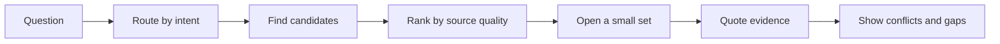

# ai-internet-search

**Internet research for AI agents that is defensible, not just cheap.**

`ai-internet-search` finds candidate pages, ranks them by source quality before
reading them, quotes evidence, surfaces disagreement, and says what it could
not establish. It is a zero-runtime-dependency Node.js CLI and MCP server for
agents that need useful research without hiding uncertainty behind a majority
vote.

[](https://www.npmjs.com/package/ai-internet-search)
[](https://github.com/rambaarde/ai-internet-search/actions/workflows/ci.yml)
[](https://github.com/rambaarde/ai-internet-search/blob/main/LICENSE)

## Quick start

Requires Node.js 18 or newer.

```sh
npm install -g ai-internet-search
ai-internet-search "what is a connection pool"
```

Or run it without installing:

```sh
npx ai-internet-search "what is a connection pool"
```

The output is intentionally compact and machine-readable. A typical result
contains a query kind, selected handler, research decision, certainty, quoted
claims, source pointers, conflicts, and any gaps:

```text
query_kind: engineering
handler: engineering_sources
decision: answer
certainty: moderate

claims[...]{tier,host,claim}:
  ... quoted evidence ...

sources[...]{tier,host,why,url}:
  ... source pointers ...
```

Network results vary. Finding nothing is still a successful, explicit answer:

```text
could_not_establish: no source above the noise floor answered this.
```

## Why it works this way

Search engines return a mixture of official documentation, research, copied
articles, and content farms. Counting results lets repeated low-quality claims
outvote a better source. This tool makes credibility part of the retrieval
pipeline:



The default pass opens at most one page per host and a small number of pages
overall. It ranks candidates before fetching their bodies, so the same choice
reduces noise, latency, and tokens. Authority is the primary sort key; title
relevance and a URL-based freshness heuristic only break ties.

The source tiers are deliberately explainable:

| Tier | Typical sources | Meaning |
| --- | --- | --- |
| 1 | Official docs, specifications, RFCs, source, changelogs, registries | The thing itself |
| 2 | Papers, issue threads, vendor engineering blogs | People who built or study it |
| 3 | Practitioner Q&A, reference sites, forums | Useful secondary evidence |
| 4 | Content aggregators and SEO listicles | Lowest default trust |

An unrecognised host starts at tier 3. Unknown is not automatically junk.

## Typed decisions and uncertainty

Every research plan exposes a bounded decision object. It is deterministic in
the open-source implementation, so it can be audited and tested without a
model dependency:

```text
query_kind: definition | engineering | academic
decision: answer | search_more | escalate_uncertainty | inspect_plan
evidence_sufficient: no | uncertain | yes
probability: 0..1
```

The same decision is available in TOON output, `--json`, and the MCP
`research` tool. The evaluator is isolated in `lib/decisions.js`, so a future
local model can replace the heuristic without changing the output contract.

The research plan includes four Jev-inspired controls:

- intent routing selects a reference, engineering, or academic handler;
- eligible providers can fan out in parallel;
- source scoring combines authority, title relevance, and URL freshness;
- an optional consistency hook can mark repeated borderline outputs unstable.

The last item does not trigger repeated network searches by default. If the
evidence is insufficient, the result tells the caller whether to answer,
inspect the plan, search more, or escalate uncertainty. That keeps iteration
under the control of the calling agent.

The default uncertainty band for binary decisions is `< 0.30 → no`,
`0.30–0.70 → uncertain`, and `> 0.70 → yes`. These are starting thresholds,
not calibration guarantees; tune them against labeled examples and the cost of
wrong automation versus human review. The pattern is adapted from TypeSafe's
[self-consistency cookbook](https://docs.typesafe.ai/cookbooks/consistency_noul_cookbook).

## One question, one pass

The tool performs one retrieval pass per invocation. It does not silently enter
a reflection loop or keep re-searching after a gap. This is intentional:

- simple factual questions usually need one focused retrieval pass;
- multi-hop questions are better split by the caller into several calls;
- an insufficient result is explicit (`search_more` or
  `escalate_uncertainty`) instead of being turned into a confident guess.

Provider discovery may run in parallel, but page reading remains bounded and
the output keeps the source tier, quoted evidence, and known gaps visible.

## Usage

```sh
ai-internet-search "<question>"                    # research
ai-internet-search --plan "<question>"             # triage; fetch nothing
ai-internet-search --limit 5 "<question>"          # open more sources
ai-internet-search --per-host 2 "<question>"       # allow more per host
ai-internet-search --json "<question>"             # JSON output
ai-internet-search --report "<question>"           # write an HTML report
ai-internet-search --report=out.html "<question>"  # choose report path
ai-internet-search --render "<question>"           # retry readable pages in Chromium
```

Exit codes are stable for callers:

| Code | Meaning |
| --- | --- |
| `0` | Success, including an explicit empty result |
| `1` | Runtime or research error |
| `2` | Unknown flag or bad usage |

### Query directives

Google-style directives scope candidates returned by a provider without
polluting the keyword search:

```sh
ai-internet-search "postgres pooling site:github.com"
ai-internet-search 'rate limiting -site:reddit.com intitle:"token bucket"'
```

Supported directives are `site:` / `-site:`, `inurl:` / `-inurl:`,
`intitle:` / `-intitle:` and `filetype:`. A `site:` value may include a path.
`after:` and `before:` are intentionally not supported because candidates do
not reliably carry publication dates.

Directives are lenient: if a filter would remove every candidate, it is
relaxed and the output explains why. A restrictive query should not turn into
silence just because a provider omitted a field.

### Rendering pages that fetch cannot read

Some pages return an empty client-rendered shell or a `403` to a plain fetch.
With `--render`, the tool retries the source in an already-installed,
headless Chrome or Chromium and sends the rendered DOM through the same scoring
and extraction path:

```sh
ai-internet-search --render "..."
```

Rendering is opt-in, adds no npm dependency, and is a no-op with an explicit
message when no compatible browser is available. It helps read a page; it does
not improve provider discovery.

### Reading through your own browser

`--browser URL` retries a source in a running Chrome over the Chrome DevTools
Protocol, using that profile's cookies and logins:

```sh
"/Applications/Google Chrome.app/Contents/MacOS/Google Chrome" \
  --remote-debugging-port=9222 \
  --user-data-dir="$HOME/.ai-internet-search-chrome"

ai-internet-search --browser http://127.0.0.1:9222 "..."
```

This path needs Node.js 22 or newer because it uses Node's built-in WebSocket
client. Only `http:`, `https:`, and `data:` URLs are opened. A DevTools port
allows local processes to control that browser, so close the profile when you
are done.

## General-web recall

The default providers are keyless and focused: Wikipedia, OpenAlex, DOAJ,
Hacker News, GitHub issues, and Stack Overflow. They cover reference,
academic, practitioner, and bug-diagnosis questions, but not all general-web
"how do I..." searches.

Enable a general-web provider when you need broader recall:

```sh
export MARGINALIA=1
# Or configure one keyed provider:
export GOOGLE_SEARCH_API_KEY=...
export GOOGLE_SEARCH_CX=...
ai-internet-search "how do I keep a status page realtime"
```

Other supported keyed providers are `BRAVE_API_KEY`, `TAVILY_API_KEY`, and
`SERPER_API_KEY`. The first available keyed provider is used in the order
Brave, Tavily, Serper, then Google. Provider results enter the same tiered
ranking; provider count is never treated as consensus.

## MCP and agent clients

Install once to put both binaries on `PATH`:

```sh
npm install -g ai-internet-search
```

The package provides `ai-internet-search` and `ai-internet-search-mcp`.

Terminal agents can run the CLI directly. If a client prefers MCP, register
the stdio server:

```sh
claude mcp add --scope user ai-internet-search -- ai-internet-search-mcp
```

The server exposes `research` and `plan_research`. For browser-resident or
remote clients, use streamable HTTP on loopback:

```sh
ai-internet-search-mcp --http 8787
```

The HTTP transport binds to `127.0.0.1` by default. Its tools use the same
research handler and output contract as the CLI.

## Agent-friendly output

The CLI follows [AXI](https://axi.md/) conventions:

- compact TOON output by default, with `--json` when strict JSON is needed;
- explicit empty states instead of silence;
- structured errors and stable exit codes;
- no interactive prompts;
- `help[]` hints for the next useful action.

## Limitations

- It is a retrieval and evidence tool, not a generative chat model.
- Keyless providers have less general-web recall than paid search APIs.
- URL freshness is a heuristic; publication dates are not universally
  available at candidate-triage time.
- It locates figures and diagrams but does not interpret their pixels.
- Multi-hop decomposition and follow-up searches remain the caller's choice.
- Network availability and source anti-bot behavior can change the result.

## Development

```sh
git clone https://github.com/rambaarde/ai-internet-search.git
cd ai-internet-search
npm test
npm pack --dry-run
```

The project has no runtime dependencies. Unit tests use Node's built-in test
runner; network-dependent checks skip cleanly when offline.

## License

MIT
