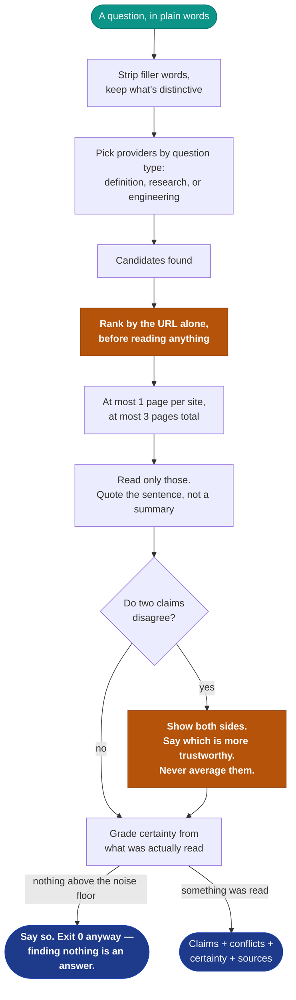

# ai-internet-search

**Internet research for AI agents that is defensible, not just cheap.**

Ranks sources by credibility instead of counting them, shows disagreement
instead of averaging it, and says what it could not establish.

```sh
npx ai-internet-search "what is a connection pool"
```

[](https://www.npmjs.com/package/ai-internet-search)
[](https://github.com/rambaarde/ai-internet-search/actions/workflows/ci.yml)
[](https://github.com/rambaarde/ai-internet-search/actions/workflows/publish.yml)


```
certainty: moderate — a primary source, but only one

claims[9]{tier,host,claim}:
  1,github.com,Your little 4-Core i7 server with one hard disk should be running a connection pool of:
  1,github.com,Reducing the connection pool size alone decreased response times from ~100ms to ~2ms.
  3,pgdog.dev,One of its features is connection pooling  which allows many clients to share a database.
  3,sudhir.io,A pool is an object that maintains a set of connections internally.

visuals[1]{tier,host,why,url}:
  1,github.com,filename says it carries data,https://github.com/.../Postgres_Chart.png

sources[3]{tier,host,why,url}:
  1,github.com,source code or changelog,https://github.com/brettwooldridge/HikariCP/wiki/About-Pool-Sizing
  3,pgdog.dev,unclassified,https://pgdog.dev/blog/why-yet-another-connection-pooler
  3,sudhir.io,unclassified,https://sudhir.io/understanding-connections-pools/

triaged: 10 found, 3 opened, 7 skipped before fetching (323kb read → 9 claims)
```

No API key. No account. Zero dependencies.

## The problem

Give an agent a question and it searches, gets ten results, and believes
whichever answer appears most often.

That is not a hunch. It is measured:

> **"Models tend to favor the majority viewpoint among retrieved contexts,
> even when opposing evidence is more credible."**
> — [Resolving Conflicting Evidence in Automated Fact-Checking](https://arxiv.org/pdf/2505.17762)

> Research agents **"consistently favored SEO-optimized content farms over
> authoritative sources."**
> — [Anthropic, on building a multi-agent research system](https://www.anthropic.com/engineering/multi-agent-research-system)

Those two compound. Content farms exist to produce volume, so *the majority
view is the farm's view*. Nine blog posts copied from one original outvote the
official documentation, every time.

Counting sources is not research. It is an echo with citations.

## The research

The design below came first, from watching agents fail on real questions —
not from a paper. Afterward, each decision was checked against what's
actually published about how AI agents fail at research. Plain language,
and what each finding means for this tool:

| finding | source | what it means here |
|---|---|---|
| Up to 1 in 5 "cited" claims from research agents don't match what the cited page says | [DeepResearch Bench](https://arxiv.org/abs/2506.11763) | Can't happen in this form. That gap opens when an agent *paraphrases* a source and cites it. This tool quotes every claim verbatim — no paraphrase step for a citation to drift away from. |
| Even a "smart" ranking flips if a wrong claim is repeated on enough low-quality pages | [Whose Facts Win?](https://arxiv.org/abs/2601.03746) | Doesn't apply. Ranking happens *before* anything is fetched, and only one page per host is ever read — volume never reaches the step that decides what to trust. |
| Which source gets read first can quietly bias the answer, separate from which one is right | position / "lost-in-the-middle" bias research | The most credible source is read first and listed first, always — nothing to be biased by. |
| Letting a model say "I don't know" instead of guessing roughly halves its error rate | abstention research | `could_not_establish` makes exactly this trade below. |
| URL-shape credibility ranking has one real gap | — | A page deliberately built to *look* like documentation (`docs.`, a plausible `.org`) could still slip into a higher tier than it deserves. Harder to fake than a purchasable "domain authority" score, but not impossible. Known, not fixed. |
| Iteration and query-splitting only help on *multi-hop* questions | Anthropic, OpenAI, Gemini, Perplexity architecture writeups | Confirms the single-pass design below rather than exposing a gap — see [One question, one pass](#one-question-one-pass). |

## The solution

**Credibility is decided before anything is read**, from the URL alone —
which is free, and happens before a single page is fetched:



The shaded boxes are the three that matter: ranking before reading anything
(the accuracy mechanism and the token saving, at once), a conflict shown
rather than blended, and an empty result that says it is empty.

| tier | source | why |
|---|---|---|
| 1 | official docs, specs, RFCs, source, changelogs, registries | the thing itself |
| 2 | papers, issue threads, vendor engineering blogs | the people who built or study it |
| 3 | practitioner Q&A, reference encyclopedias, forums | someone who read tier 1 |
| 4 | content aggregators, SEO listicles | someone who read tier 3 |

An unrecognised host is tier 3, not 4 — unproven is not the same as junk, and
the alternative buries small authoritative sites under large mediocre ones.

**This is why it is cheap.** Not reading seven of ten results is simultaneously
the accuracy mechanism and the largest token saving. You are not trading
correctness for cost — the same action buys both.

**Conflicts are found and placed.** Models are documented to detect
disagreement but fail to *localise* it, so the tool localises it: both claims,
both tiers, and which source is more authoritative. Never averaged into one
confident sentence that silently picks a side.

**Certainty is graded, never voted on.** After
[GRADE](https://www.cdc.gov/acip-grade-handbook/hcp/chapter-6-systemic-review-overview/index.html):

| grade | when |
|---|---|
| `high` | a primary source, independently corroborated |
| `moderate` | a primary source, but only one |
| `low` | no primary source read, or sources disagree |
| `very low` | aggregator-tier only |
| `none` | nothing could be read |

A live disagreement always downgrades. An answer with a known contradiction in
it is not high certainty whatever its sources.

**Gaps are stated.** Terms nothing addressed, and sources that could not be
read with the reason — `http 403`, `timed out`, `too large`. "I could not open
this" and "I read it and it said nothing" are different answers.

## Benchmarks

Measured, not estimated — every number below is reproducible with the
command beside it.

**Tokens** — what the calling agent pays, per question

| | chars | ~tokens | command |
|---|---|---|---|
| a full answer — claims, visuals, sources | 2,600 | **~650** | `ai-internet-search "<question>" \| wc -c` |
| `--plan`, nothing fetched | 876 | **~220** | `ai-internet-search --plan "<question>" \| wc -c` |
| an empty result | 441 | **~110** | `ai-internet-search "<gibberish>" \| wc -c` |

Divide chars by ~4 for a token estimate, the same rule of thumb used
throughout — no tokenizer dependency to keep the package at zero.

For comparison, [Anthropic measured](https://www.anthropic.com/engineering/multi-agent-research-system)
agents at ~4× a chat turn and multi-agent research at ~15×. This is a single
pass that opens at most three pages.

**Speed**

| | |
|---|---|
| A full question, network included | **~1.5 s** |
| `--plan`, triage only | **~0.75 s** |
| An empty result | **~0.6 s** |

```sh
time ai-internet-search "what is a connection pool" >/dev/null
```

**Footprint**

| | |
|---|---|
| Runtime dependencies | **0** |
| Package | **27 kB** (74 kB unpacked, 10 files) |
| Tests | **79**, no framework, network tests skip cleanly offline |

```sh
npm pack --dry-run && npm test
```

**What it actually read**, on the example above: 323 kB of pages fetched,
9 claims emitted, 7 of 10 candidates skipped before a single byte of them was
fetched. Skipping is the accuracy mechanism, not a shortcut on top of it —
see [The solution](#the-solution).

## Empty results are answers

```
sources[0]{tier,host,title}:

could_not_establish: no source above the noise floor answered this.
  4 candidate(s) were found and none were relevant enough to open.
```

Silence is indistinguishable from a crash, and a confident guess is worse than
either. Finding nothing exits `0` — it is an answer, not a failure.

## It finds the figures, it does not describe them

An agent reads plain text. A benchmark chart, an architecture diagram, or a
latency graph is exactly where the load-bearing evidence usually lives, and it
is invisible to text extraction.

So charts and diagrams are located and returned as pointers, with the sentence
that introduced them:

```
visuals[2]{tier,host,why,url}:
  1,github.com,chart or benchmark,https://github.com/.../pool-size-vs-latency.png
  2,arxiv.org,figure,https://arxiv.org/.../fig3-throughput.png
```

Chrome — avatars, icons, logos, spacers, tracking pixels — is filtered out.

**It does not claim to have read them.** The tool has no vision model; it says
where a figure is and what the page said about it, and a multimodal agent can
fetch it. Alt text was tried first and abandoned after measurement: Wikipedia's
"descriptive" alt attributes turned out to be *"The Free Encyclopedia"* and
*"Wikimedia Foundation"*. Alt text describes the site, not the science.

## One question, one pass

No query decomposition, no re-searching on a found gap, no reflection loop.
This is deliberate, not unfinished: every published deep-research
architecture — [Anthropic](https://www.anthropic.com/engineering/multi-agent-research-system),
OpenAI, Gemini, Perplexity — reserves iteration for **multi-hop** questions,
ones whose answer isn't in any single source. Perplexity, the most
iteration-heavy of them, still routes a simple factual query through one
retrieval pass, same as this tool does for every question. Nothing published
measures a decomposition gain on a single-fact question.

A multi-hop question is better split by the caller, which already has an LLM,
into several calls to this tool — decomposition done by the party that
already reasons, without an LLM or a dependency inside the pipeline.

## Usage

```sh
ai-internet-search "<question>"              research a question
ai-internet-search --plan "<question>"       triage only, fetch nothing
ai-internet-search --limit 5 "<question>"    open more sources
ai-internet-search --json "<question>"       JSON instead of TOON
ai-internet-search --report "<question>"     also write a standalone HTML report
```

| exit | meaning |
|---|---|
| `0` | success, including "found nothing" |
| `1` | error |
| `2` | unknown flag or bad usage |

## Works in the terminal and in GUI clients

Terminal agents call the CLI. GUI clients — Claude Desktop, the Cursor app —
have no shell, so an MCP server ships alongside:

```json
{
  "mcpServers": {
    "ai-internet-search": { "command": "ai-internet-search-mcp" }
  }
}
```

Clients that connect by **URL** rather than by spawning a command — browser-
resident agents, anything remote — need an HTTP transport instead:

```sh
ai-internet-search-mcp --http 8787   # streamable-http, 127.0.0.1 only
```

Same handler, same tools, **the same bytes on the wire**: the handshake plus
both tool schemas measures 415 tokens over either transport. A transport choice
costs nothing in tokens, it only changes who can reach the server. It binds to
loopback and nothing else.

Two tools, `research` and `plan_research`. The MCP `instructions` field carries
the rules with the result, because a result whose conflicts get averaged back
into one confident paragraph has lost everything the tool was for.

**Do not register the MCP server for a terminal agent.** It has a shell; MCP
would add a layer that can only go out of date, and AXI measures MCP at 185k
tokens per task against 79k for a CLI.

## Built for agents to call

Follows [AXI](https://axi.md/) conventions for agent-ergonomic CLIs:

- **TOON output** rather than JSON — same information, fewer tokens
- **Definitive empty states** — never silence
- **Structured errors on stdout**, exit `0`/`1`/`2`
- **No interactive prompts** — every parameter is a flag
- **`help[]` next-step hints** appended to output
- **Content-first** — running it bare says what it is, not a help dump

## Sources

Key-less by default: Hacker News, Wikipedia, OpenAlex. No signup between an
agent and its first useful answer.

The trade is **recall** — key-less providers miss things a paid index would
find, and the tool tells you when that happens rather than inventing an answer.
The provider layer is swappable; a search API buys better coverage, not a
different pipeline.

## Install

```sh
npm install -g ai-internet-search
# or
npx ai-internet-search "<question>"
```

Node 18+. Nothing else.

## Tests

```sh
npm test
```

No framework, no mocks for the unit tests, and the network tests skip cleanly
when offline so a red CI means a real failure.

## License

MIT
